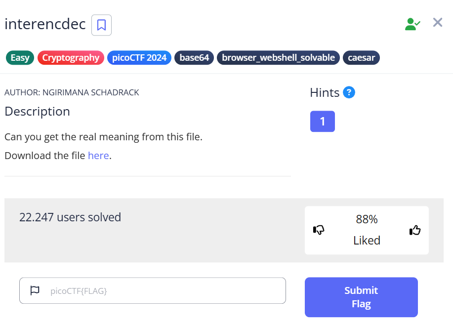

***interencdec***



Tải file trên đề bài về, có file **enc_flag**<br>
Đọc file, ta có đoạn code sau:<br>
```
YidkM0JxZGtwQlRYdHFhR3g2YUhsZmF6TnFlVGwzWVROclgyZzBOMm8yYXpZNWZRPT0nCg==
```
Đây là một đoạn mã [Base64](https://www.base64decode.org/), giải mã đoạn code, ta được một đoạn code mới:<br>
```
b'd3BqdkpBTXtqaGx6aHlfazNqeTl3YTNrX2g0N2o2azY5fQ=='
```
Ở đây ta chỉ lấy phần trong dấu '', giải mã tiếp theo Base64, ta được: 
```
wpjvJAM{jhlzhy_k3jy9wa3k_h47j6k69}
```
Ta thấy đoạn mã có phần tương đồng với một flag "picoCTF{...}"<br>
Giải đoạn mã trên theo [Caesar](https://cryptii.com/pipes/caesar-cipher), ta được flag: ```picoCTF{caesar_d3cr9pt3d_a47c6d69}```