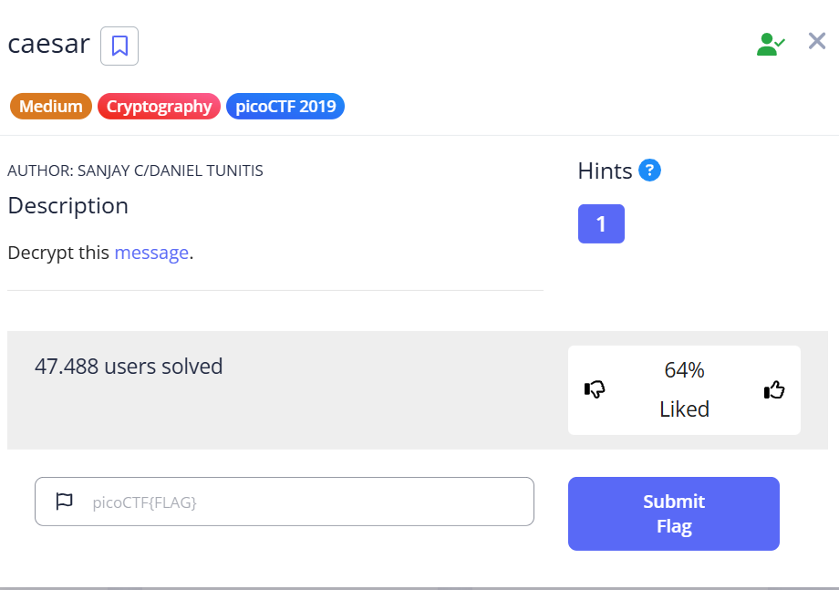
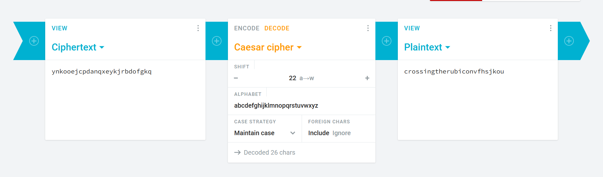

***caesar***



Tải file về và đọc file, được đoạn mã sau: 
```picoCTF{ynkooejcpdanqxeykjrbdofgkq}```<br>
Đây không phải flag đúng, ta cần phải giải tiếp phần đoạn mã trong {} theo [Caesar](https://cryptii.com/pipes/caesar-cipher) 22 a -> w,<br>



Flag: ```picoCTF{crossingtherubiconvfhsjkou}```