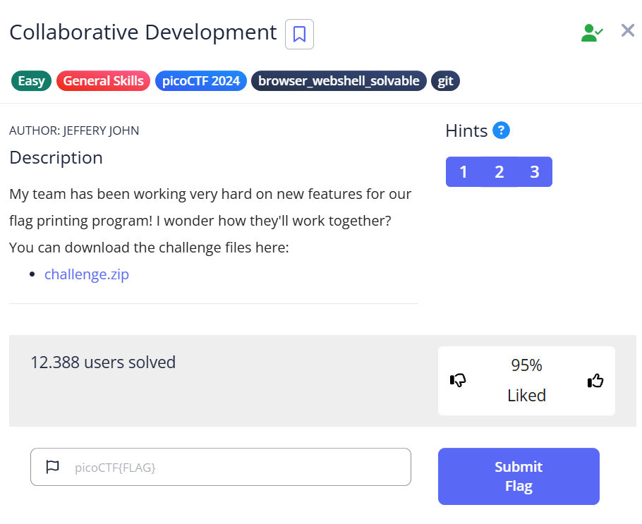
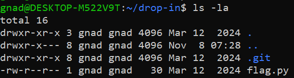
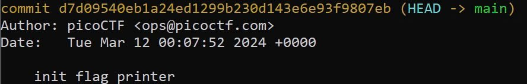
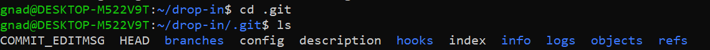
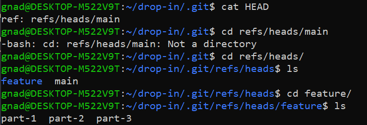
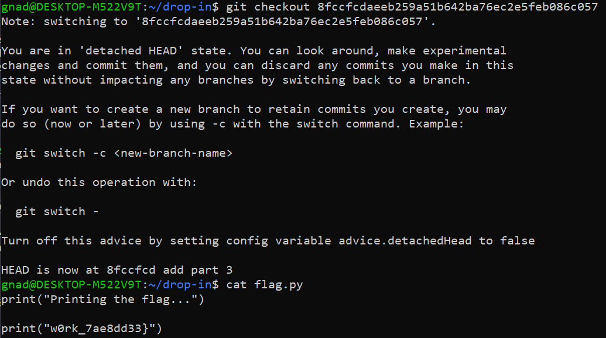

***Collaborative Development***



Tải file [challenge.zip](https://artifacts.picoctf.net/c_titan/177/challenge.zip) về <br>

unzip file vừa tải, được thư mục **drop-in**<br>
Vào thư mục drop-in, kiểm tra toàn bộ file và thư mục con<br>



Có file **flag.py** và thư mục ẩn **.git**, cat file ta dược dòng chữ: print("Printing the flag...")<br>
Dùng lệnh **git log**: kiểm tra commit có sự thay đổi nào ko<br>



Vào thư mục **.git**:<br>



cat file **HEAD**, ta được đoạn sau: *ref: refs/heads/master*<br>
Vào địa chỉ heads, có thư mục feature, bên trong có 3 file: **part-1  part-2  part-3**<br>



Lần lượt cat 3 file:<br>

    cat part-1: b2e05429742e8784eee7dc83b6a9d1fb904988c0
    cat part-2: e1629c73b55d8831cfa3cda13a74c3e8f7c9e2f1
    cat part-3: 8fccfcdaeeb259a51b642ba76ec2e5feb086c057

Về lại thư mục **.git**, cat file **COMMIT_EDITMSG**, được dòng chữ *add part 3*
Về lại thư mục **drop-in**, sử dụng lệnh sau:<br>
```git checkout 8fccfcdaeeb259a51b642ba76ec2e5feb086c057```<br>
cat lại file **flag.py**, ta được: <br>
```
print("w0rk_7ae8dd33}")
```



Tương tự với các đoạn trong file **part-1** và **part-2**, ta lần lượt được các đoạn sau:<br>
```
print("picoCTF{t3@mw0rk_", end='')
print("m@k3s_th3_dr3@m_", end='')
```

---> Flag: ***picoCTF{t3@mw0rk_m@k3s_th3_dr3@m_m@k3s_th3_dr3@m_w0rk_7ae8dd33}***