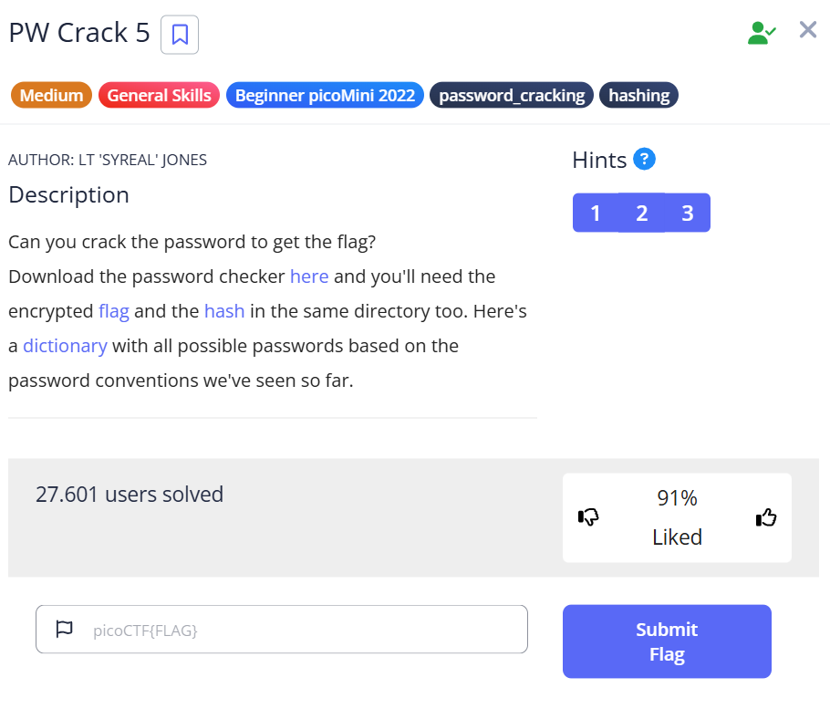

***PW Crack 5***



Tải các file về, ta lần lượt được các file như sau: <br>
```dictionary.txt  level5.flag.txt.enc  level5.hash.bin  level5.py``` <br>
Trong đó **level5.py** là một đoạn code python yêu cầu ta nhập mật khẩu và chương trình sẽ in ra flag:
```python
import hashlib

### THIS FUNCTION WILL NOT HELP YOU FIND THE FLAG --LT ########################
def str_xor(secret, key):
    #extend key to secret length
    new_key = key
    i = 0
    while len(new_key) < len(secret):
        new_key = new_key + key[i]
        i = (i + 1) % len(key)
    return "".join([chr(ord(secret_c) ^ ord(new_key_c)) for (secret_c,new_key_c) in zip(secret,new_key)])
###############################################################################

flag_enc = open('level5.flag.txt.enc', 'rb').read()
correct_pw_hash = open('level5.hash.bin', 'rb').read()


def hash_pw(pw_str):
    pw_bytes = bytearray()
    pw_bytes.extend(pw_str.encode())
    m = hashlib.md5()
    m.update(pw_bytes)
    return m.digest()


def level_5_pw_check():
    user_pw = input("Please enter correct password for flag: ")
    user_pw_hash = hash_pw(user_pw)

    if( user_pw_hash == correct_pw_hash ):
        print("Welcome back... your flag, user:")
        decryption = str_xor(flag_enc.decode(), user_pw)
        print(decryption)
        return
    print("That password is incorrect")


level_5_pw_check()
```
Các mật khẩu để kiểm tra nằm trong file **dictionary.txt**, tuy nhiên số lượng mật khẩu cần để kiểm tra là rất nhiều, ta không thể lần kiểm tra bằng cách chạy chương trình và nhập từng mật khẩu.<br>
Trong đoạn code python, ta sẽ thêm một vòng lặp vô hạn ```while True``` ở trong ```level_5_pw_check()```
```python
def level_5_pw_check():
    while True:
        user_pw = input("Please enter correct password for flag: ")
        user_pw_hash = hash_pw(user_pw)

        if user_pw_hash == correct_pw_hash:
            print("Welcome back... your flag, user:")
            decryption = str_xor(flag_enc.decode(), user_pw)
            print(decryption)
            return
        else:
            print("That password is incorrect. Please try again.")
```
Để chạy các mật khẩu trong file **dictionary.txt**, ta nhập dòng lệnh sau: ```cat dictionary.txt | python3 level5.py```<br>
Khi kiểm tra tới mật khẩu đúng, màn hình sẽ hiện ra: 
```
Please enter correct password for flag: Welcome back... your flag, user:
picoCTF{h45h_sl1ng1ng_40f26f81}
```

Flag: picoCTF{h45h_sl1ng1ng_40f26f81}.