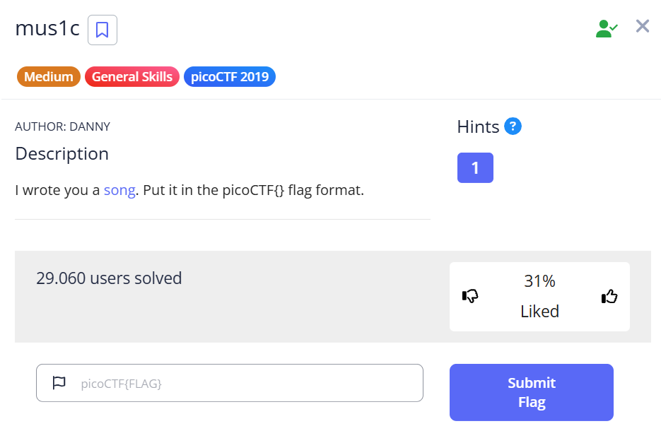
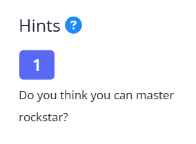

***mus1c***



Tải file về, mở file tên lyrics.txt, ta có lời 1 bài hát

```rockstar
Pico's a CTFFFFFFF
my mind is waitin
It's waitin

Put my mind of Pico into This
my flag is not found
put This into my flag
put my flag into Pico


shout Pico
shout Pico
shout Pico

My song's something
put Pico into This

Knock This down, down, down
put This into CTF

shout CTF
my lyric is nothing
Put This without my song into my lyric
Knock my lyric down, down, down
```

Trong lời bài hát lặp rất nhiều 2 từ "shout" và "put"
Đọc hint: "Do you think you can master rockstar?"



Tìm kiếm 3 cụm từ "shout", "put" và "rockstar" -> có ngôn ngữ lập trình tên là [rockstar](https://codewithrockstar.com/)<br>
Giải mã lời bài hát theo ngôn ngữ trên ta được 1 dãy số<br>
```114 114 114 111 99 107 110 114 110 48 49 49 51 114```<br>
Dịch đoạn số theo mã ASCII ta được cụm từ: ```rrrocknrn0113r```

Flag: ```picoCTF{rrrocknrn0113r}```