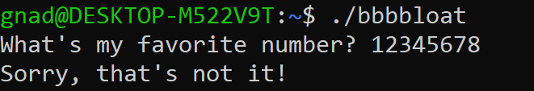
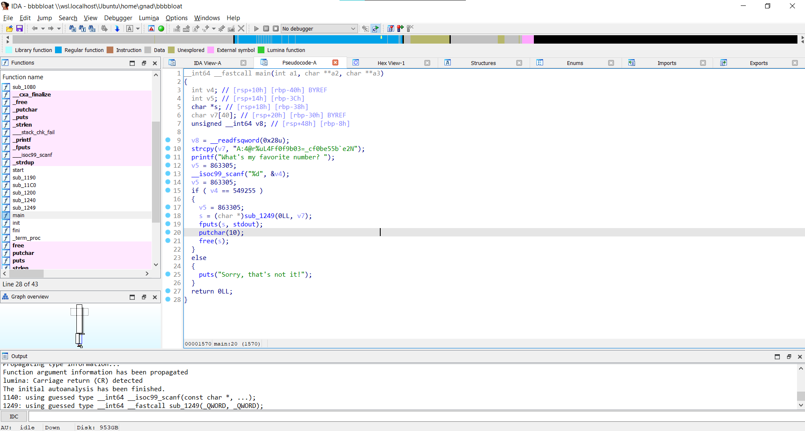
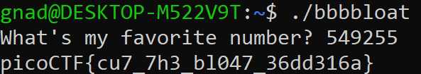

***Bbbbloat***
====


Tải file về, khi mở file thì ta được yêu cầu nhập "số yêu thích":<br>


Mở file trong phần mềm IDA, ở hàm **main**, phần **Pseusdocode-A** ta được một đoạn code:
```c++
__int64 __fastcall main(int a1, char **a2, char **a3)
{
  int v4; // [rsp+10h] [rbp-40h] BYREF
  int v5; // [rsp+14h] [rbp-3Ch]
  char *s; // [rsp+18h] [rbp-38h]
  char v7[40]; // [rsp+20h] [rbp-30h] BYREF
  unsigned __int64 v8; // [rsp+48h] [rbp-8h]

  v8 = __readfsqword(0x28u);
  strcpy(v7, "A:4@r%uL4Ff0f9b03=_cf0be55b`e2N");
  printf("What's my favorite number? ");
  v5 = 863305;
  __isoc99_scanf("%d", &v4);
  v5 = 863305;
  if ( v4 == 549255 )
  {
    v5 = 863305;
    s = (char *)sub_1249(0LL, v7);
    fputs(s, stdout);
    putchar(10);
    free(s);
  }
  else
  {
    puts("Sorry, that's not it!");
  }
  return 0LL;
}
```


Thấy được số cần nhập vào là **549255**.<br>
Quay trở lại file đề bài, chạy file và nhập số ở trên, ta được flag:<br>



<br>

Flag
===
picoCTF{cu7_7h3_bl047_36dd316a}
