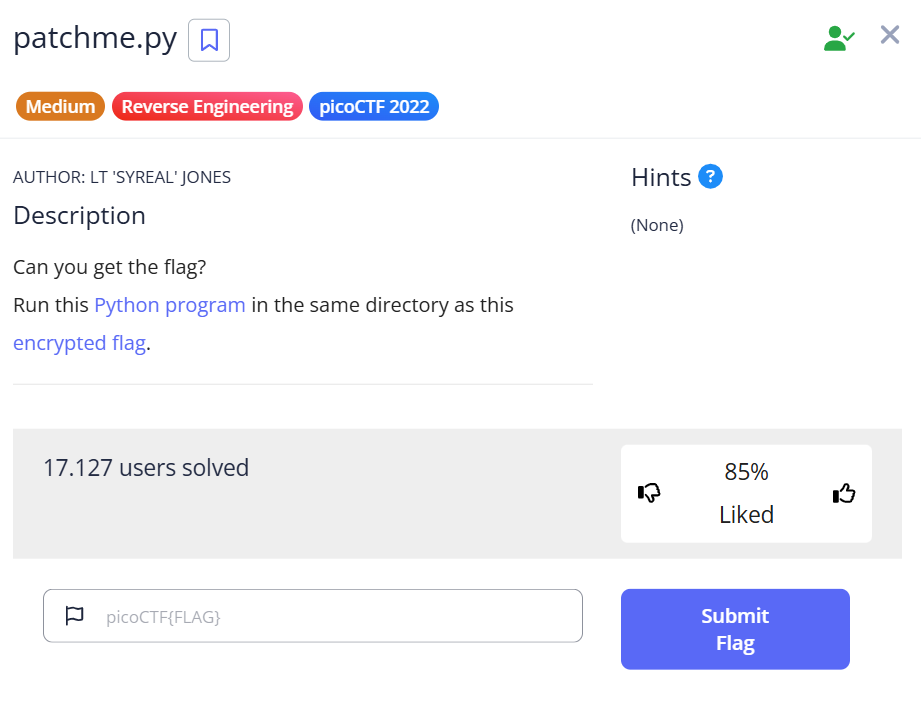

***patchme.py***
===


File chương trình python yêu cầu nhập mật khẩu để in ra flag:<br>


cat file trên, ta có đoạn code:<br>
```python
import base64
from cryptography.fernet import Fernet


payload = b'gAAAAABkzWGO_8MlYpNM0n0o718LL-w9m3rzXvCMRFghMRl6CSZwRD5DJOvN_jc8TFHmHmfiI8HWSu49MyoYKvb5mOGm_Jn4kkhC5fuRiGgmwEpxjh0z72dpi6TaPO2TorksAd2bNLemfTaYPf9qiTn_z9mvCQYV9cFKK9m1SqCSr4qDwHXgkQpm7IJAmtEJqyVUfteFLszyxv5-KXJin5BWf9aDPIskp4AztjsBH1_q9e5FIwIq48H7AaHmR8bdvjcW_ZrvhAIOInm1oM-8DjamKvhh7u3-lA=='

key_str = 'correctstaplecorrectstaplecorrec'
key_base64 = base64.b64encode(key_str.encode())
f = Fernet(key_base64)
plain = f.decrypt(payload)
exec(plain.decode())
```

"Mật khẩu" (ở đây là đoạn code yêu cầu nhập mật khẩu và trả về giá trị nào đó) có vẻ như đã được mã hóa theo [fernet](https://www.tutorialspoint.com/fernet-symmetric-encryption-using-a-cryptography-module-in-python#:~:text=Fernet%20is%20a%20symmetric%20encryption,to%20encode%20and%20decode%20messages.).<br>
Phần được mã hóa là **payload**, còn key là dạng base64 của **key_str** ```correctstaplecorrectstaplecorrec``` :<br>
```
Y29ycmVjdHN0YXBsZWNvcnJlY3RzdGFwbGVjb3JyZWM=
```

Sử dụng [tool](https://asecuritysite.com/tokens/ferdecode) sau để decode lại "Mật khẩu", ta được đoạn code hoàn chỉnh:


Flag:
===
picoCTF{175_chr157m45_5274ff21}
