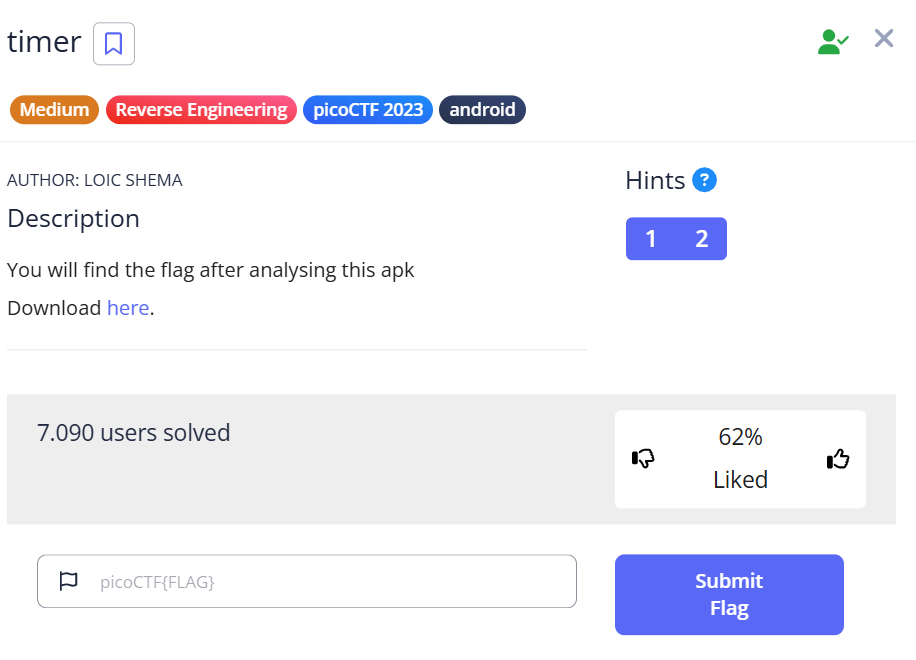

***timer***
===



Tải file apk về, sử dụng [tool](http://www.javadecompilers.com/apk) sau để decompile, ta được 2 tệp tin lớn:


Trong tệp **resources**, có các file và tệp tin sau:


Tải file **AndroidManifest.xml**, kiểm tra định dạng file, ở bài này thì flag được giấu trong file này, nên ta chỉ cần thực hiện lệnh sau:
```strings AndroidManifest.xml | grep "pico"```


Flag:
===
picoCTF{t1m3r_r3v3rs3d_succ355fully_17496}
