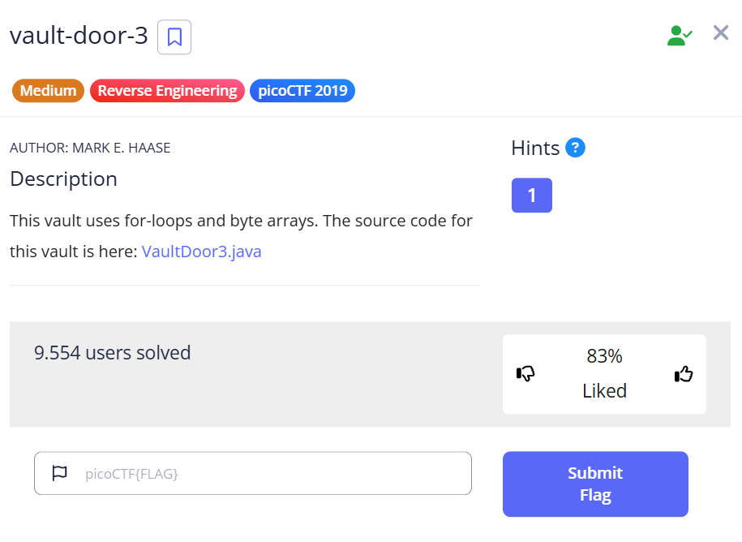

***vault-door-3***
=


Tương tự như các bài **vault-door** trước, ta có đoạn code java:
```java
import java.util.*;

class VaultDoor3 {
    public static void main(String args[]) {
        VaultDoor3 vaultDoor = new VaultDoor3();
        Scanner scanner = new Scanner(System.in);
        System.out.print("Enter vault password: ");
        String userInput = scanner.next();
        String input = userInput.substring("picoCTF{".length(),userInput.length()-1);
        if (vaultDoor.checkPassword(input)) {
            System.out.println("Access granted.");
        } else {
            System.out.println("Access denied!");
        }
    }

    // Our security monitoring team has noticed some intrusions on some of the
    // less secure doors. Dr. Evil has asked me specifically to build a stronger
    // vault door to protect his Doomsday plans. I just *know* this door will
    // keep all of those nosy agents out of our business. Mwa ha!
    //
    // -Minion #2671
    public boolean checkPassword(String password) {
        if (password.length() != 32) {
            return false;
        }
        char[] buffer = new char[32];
        int i;
        for (i=0; i<8; i++) {
            buffer[i] = password.charAt(i);
        }
        for (; i<16; i++) {
            buffer[i] = password.charAt(23-i);
        }
        for (; i<32; i+=2) {
            buffer[i] = password.charAt(46-i);
        }
        for (i=31; i>=17; i-=2) {
            buffer[i] = password.charAt(i);
        }
        String s = new String(buffer);
        return s.equals("jU5t_a_sna_3lpm18g947_u_4_m9r54f");
    }
}
```

Từ đoạn code trên, biết được flag của đề bài là cụm từ ```jU5t_a_sna_3lpm18g947_u_4_m9r54f``` đã được xáo trộn theo như trong phần **checkPassword**<br>
Dưới đây là chương trình C++ để tìm ra flag của bài:
```C++
#include <iostream>

using namespace std;

int main(){
    string s = "jU5t_a_sna_3lpm18g947_u_4_m9r54f";
    string res = s;

    int i;
    for (i = 0; i < 8; i++) res[i] = s[i];
    for (; i < 16; i++) res[i] = s[23 - i];
    for (; i < 32; i += 2) res[i] = s[46 - i];
    for (i = 31; i >= 17; i -= 2) res[i] = s[i];
    cout << res;
    return 0;
}

```

Flag
=
```picoCTF{jU5t_a_s1mpl3_an4gr4m_4_u_79958f}```