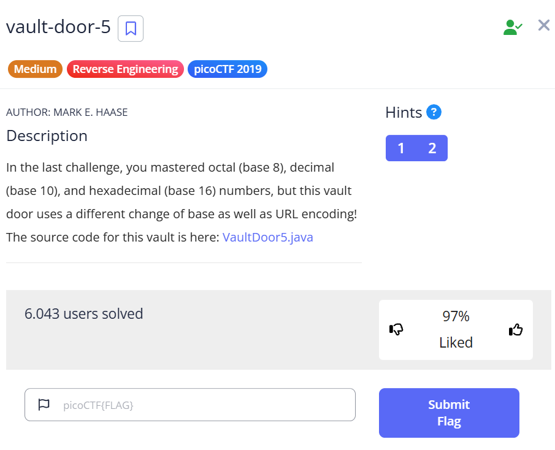

***vault-door-5***
===


Tương tự như các bài **vault-door** trước, ta có đoạn code java:
```java
import java.net.URLDecoder;
import java.util.*;

class VaultDoor5 {
    public static void main(String args[]) {
        VaultDoor5 vaultDoor = new VaultDoor5();
        Scanner scanner = new Scanner(System.in);
        System.out.print("Enter vault password: ");
        String userInput = scanner.next();
        String input = userInput.substring("picoCTF{".length(),userInput.length()-1);
        if (vaultDoor.checkPassword(input)) {
            System.out.println("Access granted.");
        } else {
            System.out.println("Access denied!");
        }
    }

    // Minion #7781 used base 8 and base 16, but this is base 64, which is
    // like... eight times stronger, right? Riiigghtt? Well that's what my twin
    // brother Minion #2415 says, anyway.
    //
    // -Minion #2414
    public String base64Encode(byte[] input) {
        return Base64.getEncoder().encodeToString(input);
    }

    // URL encoding is meant for web pages, so any double agent spies who steal
    // our source code will think this is a web site or something, defintely not
    // vault door! Oh wait, should I have not said that in a source code
    // comment?
    //
    // -Minion #2415
    public String urlEncode(byte[] input) {
        StringBuffer buf = new StringBuffer();
        for (int i=0; i<input.length; i++) {
            buf.append(String.format("%%%2x", input[i]));
        }
        return buf.toString();
    }

    public boolean checkPassword(String password) {
        String urlEncoded = urlEncode(password.getBytes());
        String base64Encoded = base64Encode(urlEncoded.getBytes());
        String expected = "JTYzJTMwJTZlJTc2JTMzJTcyJTc0JTMxJTZlJTY3JTVm"
                        + "JTY2JTcyJTMwJTZkJTVmJTYyJTYxJTM1JTY1JTVmJTM2"
                        + "JTM0JTVmJTMwJTYyJTM5JTM1JTM3JTYzJTM0JTY2";
        return base64Encoded.equals(expected);
    }
}
```

Ở đây flag đã được mã hóa theo định dạng URL, sau đó tiếp được mã hóa theo base64, cuối cùng ta được đoạn mã sau:
```
JTYzJTMwJTZlJTc2JTMzJTcyJTc0JTMxJTZlJTY3JTVmJTY2JTcyJTMwJTZkJTVmJTYyJTYxJTM1JTY1JTVmJTM2JTM0JTVmJTMwJTYyJTM5JTM1JTM3JTYzJTM0JTY2
```
Decode [base64](https://www.base64decode.org/) đoạn mã trên:
```
%63%30%6e%76%33%72%74%31%6e%67%5f%66%72%30%6d%5f%62%61%35%65%5f%36%34%5f%30%62%39%35%37%63%34%66
```
Decode [URL](https://www.urldecoder.org/) đoạn mã trên:
```c0nv3rt1ng_fr0m_ba5e_64_0b957c4f```

Flag
=
```picoCTF{c0nv3rt1ng_fr0m_ba5e_64_0b957c4f}```